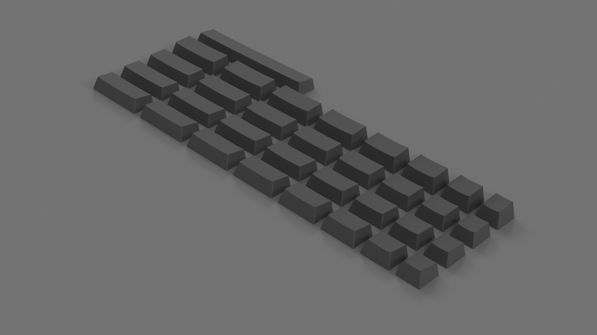
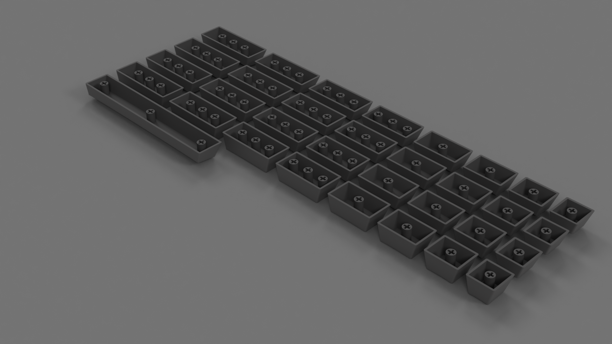

# cherry-mx-keycaps

:warning: 

This is the thick-walled version of the keys which are better suited for machining out of material like wood. For the thin-walled version of keys, more representative of the injected molded parts, visit the [thin-walled master branch]().

---

This repo contains 3D models of Cherry MX keycaps; widths included 1x1 through 1x2.5 for rows R1 through R4.

Dimensions were based off of those provided on the [wasdkeyboards](http://www.wasdkeyboards.com/) site as well as manualy checking them with calipers.

The single .step file located in [STEP](/STEP) directory contains all the keys listed above; the [STL](/STL) directory contains files for each individual key for use in 3D printing (saved with *medium* refinement).

